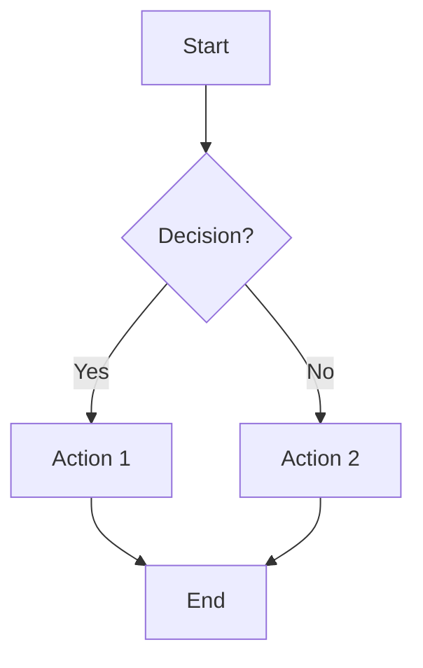
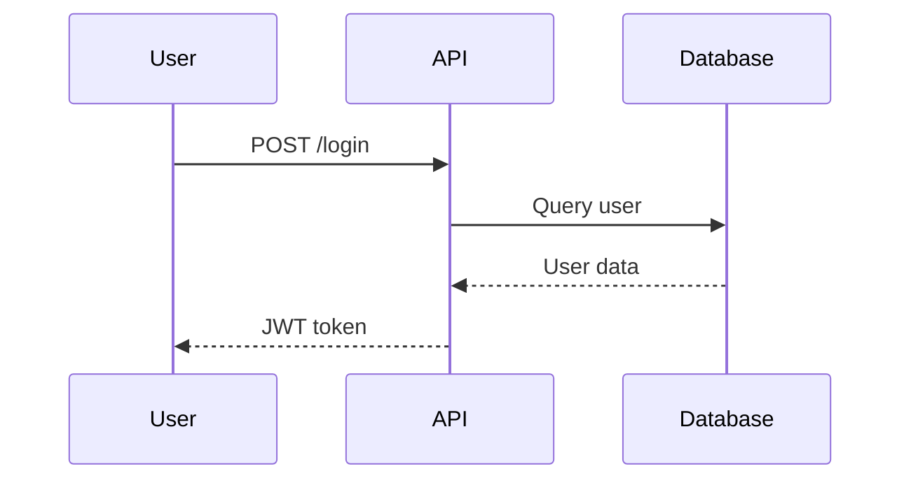
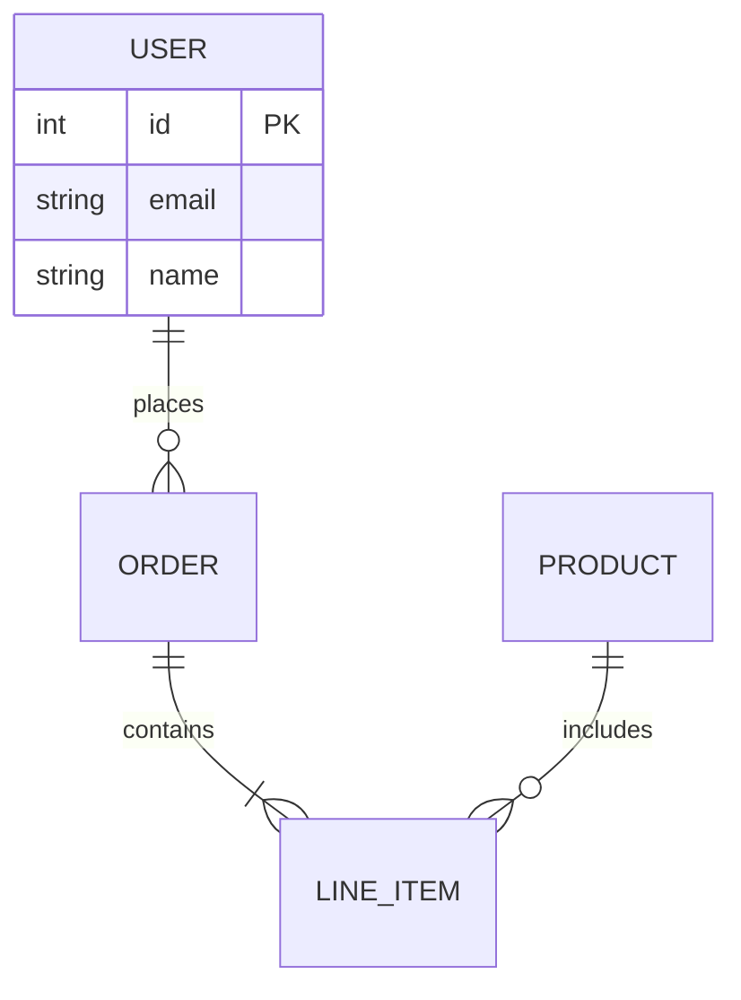
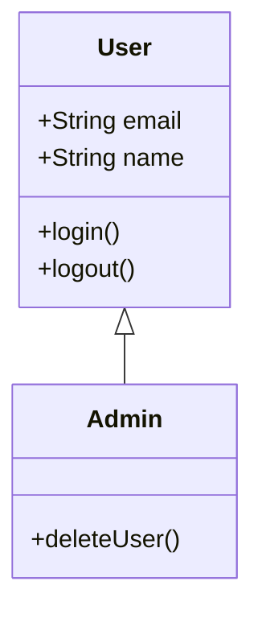
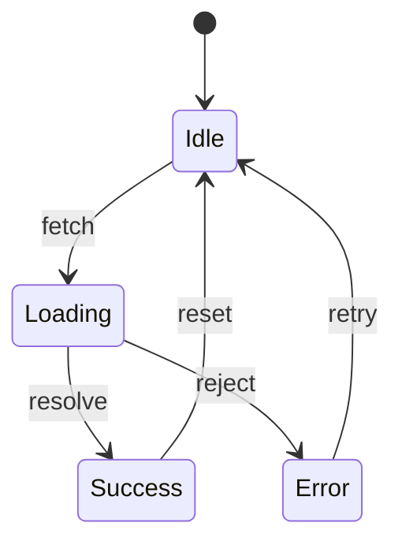
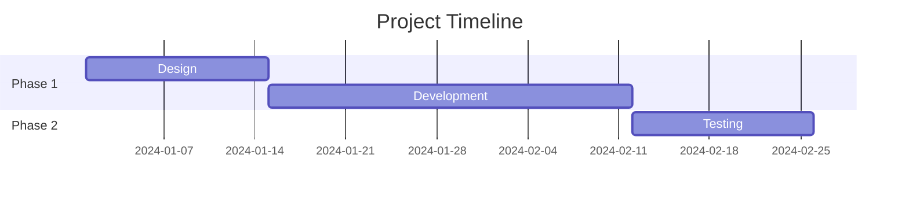
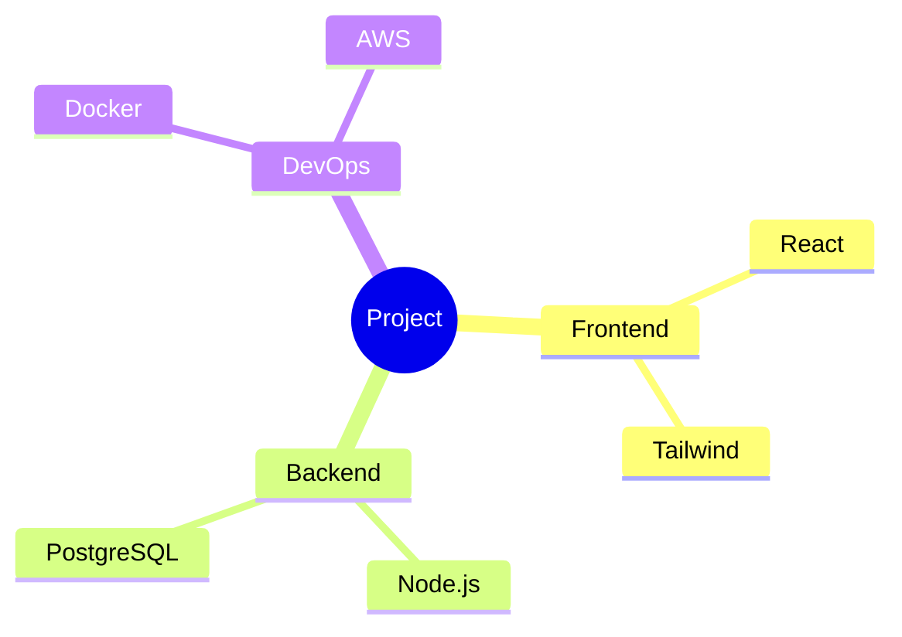

# Generate Diagram: $ARGUMENTS

Generate technical diagrams and visual documentation with Mermaid code output.

## Parse Arguments

| Argument      | Default   | Options                         |
| ------------- | --------- | ------------------------------- |
| Description   | required  | What the diagram shows          |
| `--type`      | flowchart | See diagram types below         |
| `--style`     | clean     | clean, sketch, formal, colorful |
| `--format`    | both      | png, svg, mermaid, both         |
| `--size`      | medium    | simple, medium, complex         |
| `--from-code` | false     | Analyze codebase to generate    |
| `--colors`    | default   | Brand colors or preset          |

---

## Diagram Types

| Type           | Description                              | Best For                |
| -------------- | ---------------------------------------- | ----------------------- |
| `flowchart`    | Process flows, decision trees            | Workflows, algorithms   |
| `sequence`     | Interaction sequences, API calls         | System interactions     |
| `architecture` | System components, infrastructure        | High-level design       |
| `erd`          | Entity relationship diagrams             | Database design         |
| `class`        | Class diagrams, inheritance              | OOP design              |
| `state`        | State machines, transitions              | UI states, workflows    |
| `mindmap`      | Hierarchical concepts                    | Brainstorming, planning |
| `gantt`        | Timeline, project schedule               | Project planning        |
| `wireframe`    | UI layouts, screen mockups               | UX design               |
| `network`      | Network topology                         | Infrastructure          |
| `c4`           | C4 model (context, container, component) | Architecture docs       |

---

## Workflow: AI vs Mermaid-First

### Use AI Generation When:

- Creating wireframes or visual mockups
- Need artistic/sketch style
- Complex visual that Mermaid can't express

### Use Mermaid-First When:

- Technical diagrams (flowchart, sequence, erd, class)
- Need precise control over structure
- Will iterate on the diagram
- Need version-controlled diagrams

**Recommendation:** For technical diagrams, this command generates Mermaid code that you can edit and render.

---

## Mermaid Syntax Reference

### Flowchart



**Shapes:** `[Rectangle]` `(Rounded)` `{Diamond}` `([Stadium])` `[[Subroutine]]`
**Directions:** `TD` (top-down), `LR` (left-right), `BT`, `RL`

### Sequence Diagram



**Arrows:** `->>` (solid), `-->>` (dashed), `-x` (cross), `-)` (async)

### Entity Relationship



**Cardinality:** `||` (one), `o{` (zero or more), `|{` (one or more)

### Class Diagram



**Relationships:** `<|--` (inheritance), `*--` (composition), `o--` (aggregation)

### State Diagram



### Gantt Chart



### Mindmap



---

## Style Options

| Style      | Description             | Use Case                     |
| ---------- | ----------------------- | ---------------------------- |
| `clean`    | Minimal, professional   | Documentation, presentations |
| `sketch`   | Hand-drawn appearance   | Informal, brainstorming      |
| `formal`   | Box borders, structured | Enterprise, technical docs   |
| `colorful` | Vibrant, color-coded    | Marketing, education         |

---

## Codebase Integration (--from-code)

Analyze actual code to generate diagrams:

```bash
# Generate architecture from imports
/generate-diagram system architecture --from-code --type=architecture

# Generate ERD from models
/generate-diagram database schema --from-code --type=erd

# Generate class diagram from TypeScript
/generate-diagram class relationships --from-code --type=class
```

**How it works:**

1. Scans relevant source files
2. Extracts structure (classes, functions, imports)
3. Generates Mermaid code representing actual codebase
4. Renders as diagram

---

## Examples by Type

### Flowchart

```bash
# User authentication flow
/generate-diagram user login process with email verification --type=flowchart

# Algorithm
/generate-diagram binary search algorithm --type=flowchart --style=clean
```

### Sequence Diagram

```bash
# API flow
/generate-diagram OAuth2 authentication flow between client, auth server, and resource server --type=sequence

# Microservice communication
/generate-diagram order processing across payment, inventory, and shipping services --type=sequence
```

### Architecture

```bash
# System overview
/generate-diagram e-commerce platform with React frontend, Node API, and PostgreSQL --type=architecture

# Cloud infrastructure
/generate-diagram AWS deployment with ECS, RDS, and CloudFront --type=architecture --style=formal
```

### ERD

```bash
# Database schema
/generate-diagram user management system with users, roles, and permissions --type=erd

# E-commerce
/generate-diagram product catalog with categories, variants, and inventory --type=erd
```

### State Diagram

```bash
# UI states
/generate-diagram form submission states from idle to loading to success or error --type=state

# Order lifecycle
/generate-diagram order status from pending through processing, shipped, delivered --type=state
```

---

## Size/Complexity Guidance

| Size      | Elements   | Description                  |
| --------- | ---------- | ---------------------------- |
| `simple`  | 3-5 nodes  | Quick sketch, single concept |
| `medium`  | 6-12 nodes | Standard documentation       |
| `complex` | 13+ nodes  | Comprehensive system view    |

**Tip:** Start simple, iterate to add detail.

---

## Output

### File Structure

```
.opencode/memory/design/diagrams/[name]/
├── diagram.png           # Rendered image
├── diagram.svg           # Vector version
├── diagram.mmd           # Mermaid source code
└── README.md             # Usage notes
```

### Inline Output

```markdown
## Generated Diagram

**Type:** sequence
**Description:** User authentication flow

### Mermaid Code

\`\`\`mermaid
sequenceDiagram
User->>Auth: Login request
Auth->>DB: Validate credentials
DB-->>Auth: User data
Auth-->>User: JWT token
\`\`\`

### Rendered

[PNG/SVG image displayed]

### Usage

- Embed in GitHub markdown (supports Mermaid natively)
- Use Mermaid Live Editor for modifications
- Export to PNG/SVG for presentations
```

---

## Rendering Options

| Platform     | Mermaid Support      |
| ------------ | -------------------- |
| GitHub       | Native in markdown   |
| GitLab       | Native in markdown   |
| Notion       | Via code block       |
| Confluence   | Via plugin           |
| VS Code      | Via extension        |
| Mermaid Live | https://mermaid.live |

---

## Limitations

| Limitation          | Workaround                                          |
| ------------------- | --------------------------------------------------- |
| Very large diagrams | Break into multiple smaller diagrams                |
| Custom icons        | Use external tool, embed as image                   |
| Precise positioning | Mermaid auto-layouts; use external tool for control |
| Complex styling     | Basic theming only; export SVG for advanced styling |
| Wireframes          | AI-generated image better than Mermaid              |

---

## Related Commands

| Need                 | Command            |
| -------------------- | ------------------ |
| Analyze mockup       | `/analyze-mockup`  |
| Generate image       | `/generate-image`  |
| Review architecture  | `/review-codebase` |
| Create documentation | `/summarize`       |
